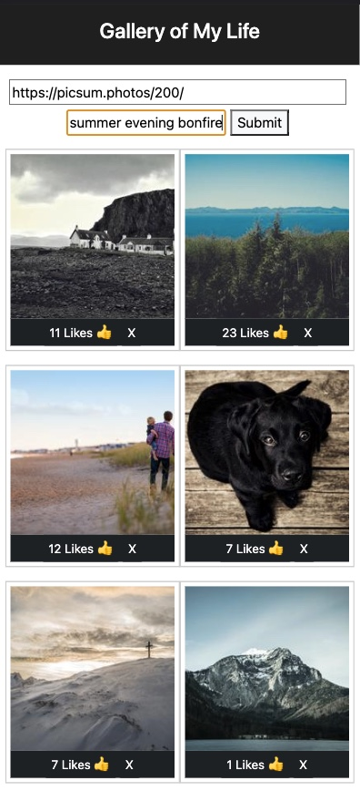

# Gallery of My Life App

## Description

_Duration: 2 Day Sprint_

The Gallery of My Life app helps anyone stay on top of their pictures. Simply add a picture using the url and give the picture a description. Click Submit to see your uploaded picture. Anyone with accesss to your Gallery can click Like on pictures they like. The App keeps a tally of the likes on each picture.
To remove a picture simply click the X button. A dialog box will appear asking the user to confirm deletion. Users can toggle a picture caption by clicking on the picture itself.
 

## Screen Shot

### Prerequisites

Link to software that is required to develop this website.

- [javascript](https://www.javascript.com/)
- [css]
- [html]
- [git](https://git-scm.com/)
- [github](https://github.com/)
- [node](https://nodejs.org/en/)
- [body-parser](https://www.npmjs.com/package/body-parser)
- [pg](https://node-postgres.com/)
- [react](https://reactjs.org/)
- [axios](https://axios-http.com/)
- [express](https://expressjs.com/)
- [sql](https://www.mysql.com/)
- [sweetalerts2](https://sweetalert2.github.io/)

## Installation

1. Go to https://github.com/tormodsletteboe/weekend-react-gallery
2. Fork that repo into your own github account.
3. Copy the ssh address
4. In your terminal navigate to a folder you want to clone into.
5. Run `git clone [ssh address]` in your terminal
6. cd into the cloned folder and run `code .` in your terminal to open the project in vscode.
7. Run 'npm install'. Npm will look at your dependecies and install needed libraries.
8. Install postgress database using include database.sql file
    -  in termial execute  'createdb react_gallery' and 
    -  'psql -d react_gallery -f database.sql'
9. To start, execute in 2 separate terminals, 'npm run server' and 'npm run client'.
10. If it started, terminal will display 'server is up on port 5000', and a website on localhost 3000 will open.
11. You can now enjoy this Gallert of My Life app.

## Usage

1. Fill out url with a valid url path. Can at most be 80 characters long.
2. Fill out a description. Can at most be 80 character long.
3. Click Submit.
4. The image will be added to the Gallery.
    - Each image can be Liked by clicking the Like button 👍.
    - Each image can be removed by clicking the X button.

## Built With

javascript, css, html, git and github.com, node, body-parser, pg, sql, react, sweetalerts2, express, axios

## Acknowledgement
Thanks to [Prime Digital Academy](www.primeacademy.io) who equipped and helped us to make this application a reality. (Edan Schwartz, Liz Kerber, Kris Szafranski)

## Support
If you have suggestions or issues, please email me at [tormod.slettebo@gmail.com] 

